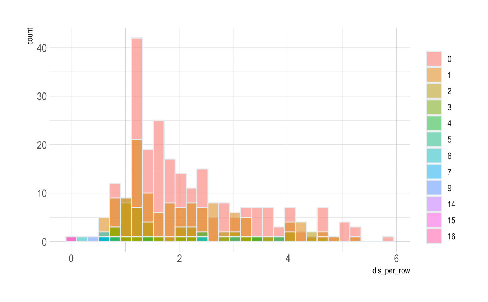

# PartialKmeans

This pakage utilizes a modified K-means algorithm to handle data with missing values.\
Details:  \
k-means clustering is a clustering method that aims to partition n observations into k clusters in which each observation belongs to the cluster with the nearest cluster centroid. However, the standard K-means algorithm fails to accomodate data with missing values. This modified k-means algorithm below takes missing values into account. When calculating the sum squared error of each data point to the centroid, we only consider the partial distance with entries with non-NA values. This innovation in the algorithm could be beneficial for large sparse datasets with missing values, especially for datasets of recommendation systems. 

# Installation

from github
``` r
install.packages("devtools")
library(devtools)
install_github("wenxi77/PartialKmeans")

```
# examples

```{r}
library(PartialKmeans)
#import required packages
library(caret)
library(ClusterR)
library(dplyr)
library(mlbench)
#get data samle
head(HouseVotes84)
        Class   V1 V2 V3   V4   V5 V6 V7 V8 V9 V10  V11  V12
 1 republican    n  y  n    y    y  y  n  n  n   y <NA>    y
 2 republican    n  y  n    y    y  y  n  n  n   n    n    y
 3   democrat <NA>  y  y <NA>    y  y  n  n  n   n    y    n
 4   democrat    n  y  y    n <NA>  y  n  n  n   n    y    n
 5   democrat    y  y  y    n    y  y  n  n  n   n    y <NA>
 6   democrat    n  y  y    n    y  y  n  n  n   n    n    n
   V13 V14 V15  V16
 1   y   y   n    y
 2   y   y   n <NA>
 3   y   y   n    n
 4   y   n   n    y
 5   y   y   y    y
 6   y   y   y    y
#convert characters to numerical numbers
encode<-function(x){
  factor(x,levels = c('n', 'y'),labels = c(1, 2))%>%as.numeric()
}
#x variables
house_votes<-apply(HouseVotes84[2:17],2,encode)
delrow<-which(apply(house_votes,1,function(row){all(is.na(row))}))
house_votes<-house_votes[-delrow,]
#y var
votes_y<-as.numeric(factor(HouseVotes84[,1]))
house.votes <- cbind(votes_y,house_votes)
```
## initialize centroids & apply Partial_km

```{r}
house_model <- Partial_km(house.votes[,2:17],k=2,initc,100)
house_model
$fitted_value
  [1] 1 1 1 1 1 1 1 1 1 2 1 1 2 2 1 1 2 2 1 2 2 2 2 2 2 2 2 2 1 2 1 2 2 1 2 1 1 1 1 2 2 2 2 2 2 2 2 2
 [49] 2 1 2 1 2 1 2 1 1 1 1 1 2 1 2 2 2 1 1 1 2 2 2 2 2 1 2 1 1 1 1 1 2 2 1 1 1 1 1 1 1 1 2 2 2 2 1 2
 [97] 1 1 2 1 1 2 2 1 2 2 1 1 2 2 2 1 2 1 2 2 2 1 2 1 1 1 1 1 2 1 1 2 2 2 2 2 1 1 1 1 1 2 2 2 2 1 1 2
[145] 2 2 1 2 1 2 1 1 2 2 1 1 1 2 1 2 1 1 1 1 1 2 1 2 1 2 2 1 2 1 2 2 2 2 2 2 2 2 2 2 2 2 2 2 1 2 1 1
[193] 2 2 2 1 2 1 2 2 2 2 2 2 1 2 1 1 2 2 2 1 2 2 1 1 2 1 2 2 2 2 2 1 1 1 2 2 1 1 1 1 2 1 2 1 2 2 2 1
[241] 1 2 1 2 2 2 2 1 1 2 1 1 2 1 2 2 1 1 2 2 2 2 2 2 2 2 1 2 2 2 2 2 2 1 1 1 1 1 1 1 2 1 1 1 2 2 2 2
[289] 2 1 2 2 2 2 2 1 1 2 2 2 1 2 1 1 1 1 1 2 1 2 1 2 2 1 1 1 1 2 2 2 2 2 1 1 1 1 2 1 2 2 1 2 2 2 2 1
[337] 2 2 2 1 1 2 2 1 2 1 1 1 2 1 2 1 2 1 2 2 1 1 2 1 2 1 2 1 1 1 2 2 2 1 2 2 1 1 1 1 2 1 1 1 2 2 1 2
[385] 1 1 2 2 1 2 1 2 1 2 1 2 2 1 2 1 1 1 2 1 1 1 1 1 2 1 1 2 1 1 2 2 1 2 2 2 1 2 2 2 2 2 2 1 2 2 1 2
[433] 1 1 1

$fitted_Centroid
         [,1]     [,2]     [,3]     [,4]     [,5]     [,6]     [,7]     [,8]     [,9]    [,10]
[1,] 1.223881 1.559783 1.207071 1.849246 1.989848 1.940299 1.193878 1.109375 1.095960 1.502488
[2,] 1.639640 1.453202 1.938053 1.035556 1.076233 1.372197 1.893333 1.969298 1.874419 1.506608
        [,11]    [,12]    [,13]    [,14]    [,15]    [,16]
[1,] 1.253886 1.804233 1.885417 1.974619 1.100000 1.645349
[2,] 1.457014 1.088372 1.178899 1.253394 1.714286 1.993711

```

## plot distance of observation with differnet number of NAs

Visualize the influence of the number of missing values for each observation by drawing density plots of the distance between the centroid and each observation. All distances are categorized by the number of NAs in each observation.

```{r}
plot_distance(house_model,house.votes[,-1],plot_type="density")$plot
```
# 


```{r}
plot_distance(house_model,house.votes[,-1],plot_type="histogram")$plot
```
# 

