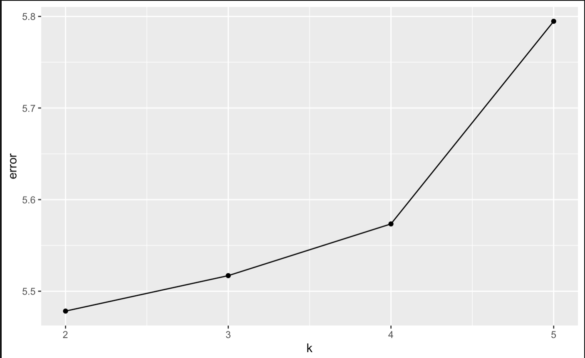

# PartialKmeans

This pakage utilizes a modified K-means algorithm to handle rows and columns with missing values.
Details:
1.Exclude data with complete missing rows and columns
2. When calculating the sum squared error of each data point to the centroid, only consider the partial distance with entries with non-NA values
3. Visualize the influence of the number of missing values for each observation by drawing density plots of the distance between the centroid and each observation
4. Visualize the ability of finding optimal number of clusters by comparing average distance between each row and cluster centroids
5. Test PartialKmeans' performance on data with different percentage of missing values. Details from "Partialkmeans/inst/0106experiement.Rmd"
# Installation

from github
```{r}
install.packages("devtools")
library(devtools)
install_github("wenxi77/Partialkmeans")
library(Partialkmeans)
```
# examples

```{r}
library(Partialkmeans)
#import required packages
library(caret)
library(ClusterR)
library(dplyr)
library('mlbench')
#get data samle
data(HouseVotes84)
head(HouseVotes84)
#        Class   V1 V2 V3   V4   V5 V6 V7 V8 V9 V10  V11  V12
# 1 republican    n  y  n    y    y  y  n  n  n   y <NA>    y
# 2 republican    n  y  n    y    y  y  n  n  n   n    n    y
# 3   democrat <NA>  y  y <NA>    y  y  n  n  n   n    y    n
# 4   democrat    n  y  y    n <NA>  y  n  n  n   n    y    n
# 5   democrat    y  y  y    n    y  y  n  n  n   n    y <NA>
# 6   democrat    n  y  y    n    y  y  n  n  n   n    n    n
#   V13 V14 V15  V16
# 1   y   y   n    y
# 2   y   y   n <NA>
# 3   y   y   n    n
# 4   y   n   n    y
# 5   y   y   y    y
# 6   y   y   y    y
#convert characters to numerical numbers
encode<-function(x){
  factor(x,levels = c('n', 'y'),labels = c(1, 2))%>%as.numeric()
}
#x variables
house_votes<-apply(HouseVotes84[2:17],2,encode)
#y var
votes_y<-factor(HouseVotes84[,1])%>%as.numeric()
house.votes <- cbind(votes_y,house_votes)
#train test split
Train_house <- gen_train_test(house.votes,seed=78)$train
Valid_house <- gen_train_test(house.votes,78)$test
```
## initialize centroids & apply Partial_km

```{r}
initc <- gen_initC(xdata=Train_house[,2:17],n_cluster=2)
house_model <- Partial_km0130(m=Train_house[,2:17],k=2,initCentroids=initc,nIters=100)
#manually specify cluster sets
house_train_fitted <- factor(house_model$fitted_value,labels = c(2,1))
test_accuracy(Train_house[,1],house_train_fitted)
# accuracy=0.8892508
house_test <- fitted.test(Valid_house[,-1],2,house_model$fitted_Centroid)
house_test_fitted <- factor(house_test$fitted_values,labels = c(2,1))
test_accuracy(Valid_house[,1],house_test_fitted)
#accuracy=0.859375
```

## plot distance of observation with differnet number of NAs
```{r}
plot_distance(house_model,Train_house[,-1],plot_type="density")$plot
```
# 
```{r}
plot_distance(house_model,Train_house[,-1],plot_type="histogram")$plot
```
# 

## find optimal number of clusters
```{r}
find_best_k <- optimal_k(5,Train_house,Valid_house)
find_best_k$error_df
# k error
# 1	3.851661			
# 2	5.478305			
# 3	5.521935			
# 4	5.758045			
# 5	5.703366	
```
```{r}
find_best_k$plot
```
# 
Expect for k=1, we see that k=2 has the smallest erroe, which should be the correct number of clusters.
